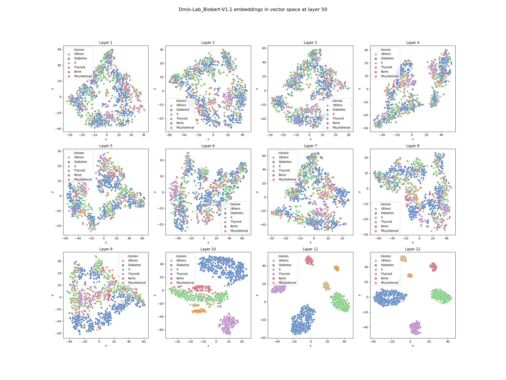

# Medical paper classification using transformer-based Pretrained Language Models
This repository contains the code and resources for text classification using the Transformer-based large language models. The work aims to classifying medical papers into 6 categories: bone, pitu/adrenal, diabetes, thyroid, others, x.     
The major purpose is to firstly classify endocrinology papers and the ones in other medical departments, and to secondly classify them into subgroups of endocrinological topics if the paper was classified under endocrinology department. The model decides the category of the papers based on the information from the title and abstract. We explore how the performance of the models changes when given the abstracts as well as titles compared to case when given the titles only. 

## Data Format
Both train.py and inference.py takes the datasets in .csv format with the following format:
|ID|category|TI|abst|
|:---:|:---:|:-----:|:-----:|
|25,729,272|bone|Long Term Effect of High Glucose and Phosphate Levels on the OPG/RANK/RANKL/TRAIL System in the Progression of Vascular Calcification in rat Aortic Smooth Muscle Cells.|...|
|25,750,573|pitu/adrenal|A giant carotid aneurysm with intrasellar extension: a rare cause of panhypopituitarism.|...|
|25,630,229|thyroid|Salivary gland dysfunction after radioactive iodine (I-131) therapy in patients following total thyroidectomy: emphasis on radioactive iodine therapy dose.|...|
|25,561,730|diabetes|Ligand Binding Pocket Formed by Evolutionarily Conserved Residues in the Glucagon-like Peptide-1 (GLP-1) Receptor Core Domain.|...|

## Environment
```shell
conda env create --file environment.yaml
```

## Train
In order to fine-tune each of the transformer models on your dataset, you can execute the following bash file:
```shell
bash train.sh
```
Please note that before executing the bash file, you need to define a set of files path in it.

### Options
```
--model                     bert-base-uncased, roberta-base, etc.
--type                      whether to use both `title` and `abstract`(title_abst) for classification or just use `title`(title).
--source                    dataset dir.
--res                       path to result dir.
--log                       path to log dir.
--checkpoint                path to best-performed model dir.
--num_labels                number of classes.
--max_sequence_len          max length of sequence tokens.
--epoch                     number of epochs.
--train_batch_size          train batch size.
--valid_batch_size          evaluation batch size.
--lr                        learning rate.
--n_warmup_steps            warmup steps.
--local_rank                local rank.
```
## Inference
In order to perform inference with the fine-tuned models, you can execute the following bash file:
```shell
bash inference.sh
```

### Option
```
--model                     bert-base-uncased, roberta-base, etc.
--type                      whether to use both `title` and `abstract`(title_abst) for classification or just use `title`(title).
--test                      path to test dataset.
--res                       path to result dir.
--log                       path to log dir.
--checkpoint                path to best-performed model dir.
--num_labels                number of classes.
--max_sequence_len          max length of sequence tokens.
--test_batch_size           test batch size.
```

## Models
All of the models on the [Huggingface](https://huggingface.co/transformers) are supported by this repository and can be used by setting the `model` parameter of train.py with the corresponding model's name. Below are some of the models used in the experiments.
```
Models = {
    "BERT base uncased": "bert-base-uncased",
    "BioBERT": "dmis-lab/biobert-v1.1",
    "SciBERT": "allenai/scibert_scivocab_uncased",
    "BleuBERT": "bionlp/bluebert_pubmed_uncased_L-12_H-768_A-12",
    "BleuBERT": "bionlp/bluebert_pubmed_mimic_uncased_L-12_H-768_A-12",
    "PubMedBERT": "microsoft/BiomedNLP-PubMedBERT-base-uncased-abstract",
    "PubMedBERT": "microsoft/BiomedNLP-PubMedBERT-base-uncased-abstract-fulltext",
    "ClinicalBERT": "emilyalsentzer/Bio_ClinicalBERT",
    "RoBERTa": "roberta-base",
    "Biomed RoBERTa": "allenai/biomed_roberta_base",
```
## Results
### Classification performance
<table class="tg">
  <tr>
    <td class="tg-fymr" rowspan="2"><b>Classifier</th>
    <td class="tg-fymr" rowspan="2"><b>Type</th>
    <td class="tg-fymr" rowspan="2"><b>Accuracy</th>
    <td class="tg-fymr" rowspan="2"><b>Precision</th>
    <td class="tg-fymr" rowspan="2"><b>Recall</th>
    <td class="tg-fymr" rowspan="2"><b>F1</th>
  </tr>
<tbody>
  <tr>
    <td class="tg-xnov">BERT (bert-base-uncased)</td>
    <td class="tg-xnov"> title + abstract </td>
    <td class="tg-xnov"> 0.85 </td>
    <td class="tg-xnov"> 0.84 </td>
    <td class="tg-xnov"> 0.85 </td>
    <td class="tg-xnov"> 0.85 </td>
  </tr>
    <tr>
    <td class="tg-xnov">BERT (bert-base-uncased)</td>
    <td class="tg-xnov"> title </td>
    <td class="tg-xnov"> 0.83 </td>
    <td class="tg-xnov"> 0.83 </td>
    <td class="tg-xnov"> 0.83 </td>
    <td class="tg-xnov"> 0.83 </td>
  </tr>

  <tr>
    <td class="tg-xnov"><b>BioBERT (dmis-lab/biobert-v1.1)</td>
    <td class="tg-xnov"><b> title + abstract </td>
    <td class="tg-xnov"><b> 0.88 </td>
    <td class="tg-xnov"><b> 0.88 </td>
    <td class="tg-xnov"><b> 0.88 </td>
    <td class="tg-xnov"><b> 0.88 </td>
  </tr>
  <tr>
    <td class="tg-xnov">SciBERT (allenai/scibert_scivocab_uncased)</td>
    <td class="tg-xnov"> title + abstract </td>
    <td class="tg-xnov"> 0.87 </td>
    <td class="tg-xnov"> 0.87 </td>
    <td class="tg-xnov"> 0.87 </td>
    <td class="tg-xnov"> 0.87 </td>
  </tr>
  <tr>
    <td class="tg-xnov">BleuBERT (bionlp/bluebert_pubmed_uncased_L-12_H-768_A-12)</td>
    <td class="tg-xnov"> title + abstract </td>
    <td class="tg-xnov"> 0.87 </td>
    <td class="tg-xnov"> 0.87 </td>
    <td class="tg-xnov"> 0.87 </td>
    <td class="tg-xnov"> 0.87 </td>
  </tr>
  <tr>
    <td class="tg-xnov">BleuBERT (bionlp/bluebert_pubmed_mimic_uncased_L-12_H-768_A-12)</td>
    <td class="tg-xnov"> title + abstract </td>
    <td class="tg-xnov"> 0.86 </td>
    <td class="tg-xnov"> 0.85 </td>
    <td class="tg-xnov"> 0.86 </td>
    <td class="tg-xnov"> 0.85 </td>
  </tr>
  <tr>
    <td class="tg-xnov">PubMedBERT (microsoft/BiomedNLP-PubMedBERT-base-uncased-abstract)</td>
    <td class="tg-xnov"> title + abstract </td>
    <td class="tg-xnov"> 0.87 </td>
    <td class="tg-xnov"> 0.87 </td>
    <td class="tg-xnov"> 0.87 </td>
    <td class="tg-xnov"> 0.87 </td>
  </tr>
  <tr>
    <td class="tg-xnov">PubMedBERT (microsoft/BiomedNLP-PubMedBERT-base-uncased-abstract-fulltext)</td>
    <td class="tg-xnov"> title + abstract </td>
    <td class="tg-xnov"> 0.87 </td>
    <td class="tg-xnov"> 0.86 </td>
    <td class="tg-xnov"> 0.87 </td>
    <td class="tg-xnov"> 0.86 </td>
  </tr>
  <tr>
    <td class="tg-xnov">ClinicalBERT (emilyalsentzer/Bio_ClinicalBERT)</td>
    <td class="tg-xnov"> title + abstract </td>
    <td class="tg-xnov"> 0.85 </td>
    <td class="tg-xnov"> 0.85 </td>
    <td class="tg-xnov"> 0.85 </td>
    <td class="tg-xnov"> 0.85 </td>
  </tr>
  <tr>
    <td class="tg-xnov">RoBERTa (roberta-base)</td>
    <td class="tg-xnov"> title + abstract </td>
    <td class="tg-xnov"> 0.84 </td>
    <td class="tg-xnov"> 0.85 </td>
    <td class="tg-xnov"> 0.84 </td>
    <td class="tg-xnov"> 0.84 </td>
  </tr>
  <tr>
    <td class="tg-xnov">Biomed Roberta (allenai/biomed_roberta_base)</td>
    <td class="tg-xnov"> title + abstract </td>
    <td class="tg-xnov"> 0.84 </td>
    <td class="tg-xnov"> 0.84 </td>
    <td class="tg-xnov"> 0.84 </td>
    <td class="tg-xnov"> 0.84 </td>
  </tr>
</tbody>
</table>

### Visualization of embedding space at epoch 50
